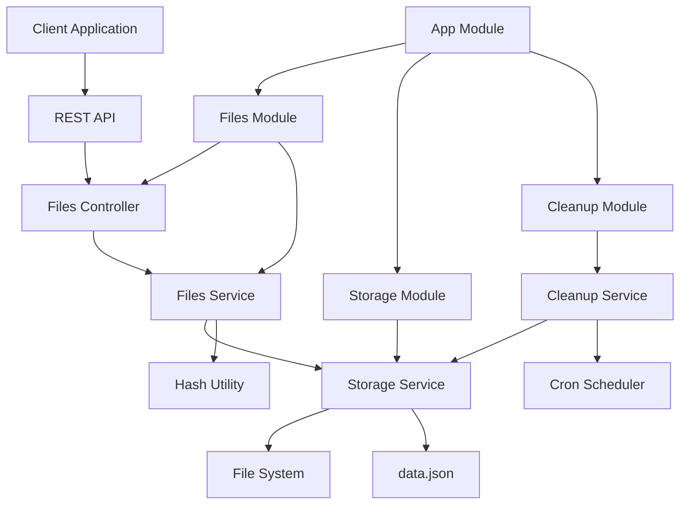

# Архитектура micro-file-cache

## Обзор архитектуры

`micro-file-cache` построен на основе модульной архитектуры с использованием NestJS фреймворка. Сервис разделен на логические модули, каждый из которых отвечает за определенную функциональность.

## Диаграмма компонентов



## Модули системы

### 1. AppModule (Корневой модуль)

**Назначение**: Координирует работу всех модулей приложения.

**Ответственность**:

- Импорт и конфигурация всех модулей
- Настройка глобальных провайдеров
- Конфигурация приложения

**Файлы**:

- `src/app.module.ts`

```typescript
@Module({
  imports: [
    ConfigModule.forRoot({
      isGlobal: true,
      envFilePath: ".env",
    }),
    FilesModule,
    StorageModule,
    CleanupModule,
  ],
  controllers: [],
  providers: [],
})
export class AppModule {}
```

### 2. FilesModule

**Назначение**: Обрабатывает HTTP запросы для работы с файлами.

**Ответственность**:

- Обработка загрузки файлов
- Предоставление информации о файлах
- Удаление файлов
- Валидация входных данных

**Компоненты**:

- `FilesController` - HTTP контроллер
- `FilesService` - бизнес-логика
- DTO классы для валидации

**Файлы**:

- `src/modules/files/files.module.ts`
- `src/modules/files/files.controller.ts`
- `src/modules/files/files.service.ts`
- `src/modules/files/dto/upload-file.dto.ts`
- `src/modules/files/dto/file-response.dto.ts`

### 3. StorageModule

**Назначение**: Управляет файловым хранилищем и метаданными.

**Ответственность**:

- Сохранение и удаление файлов
- Управление метаданными в data.json
- Работа с файловой системой
- Дедупликация файлов

**Компоненты**:

- `StorageService` - сервис для работы с хранилищем

**Файлы**:

- `src/modules/storage/storage.module.ts`
- `src/modules/storage/storage.service.ts`

### 4. CleanupModule

**Назначение**: Автоматическая очистка устаревших файлов.

**Ответственность**:

- Периодическая проверка файлов на истечение TTL
- Удаление устаревших файлов
- Логирование операций очистки

**Компоненты**:

- `CleanupService` - сервис очистки
- Cron job для периодического выполнения

**Файлы**:

- `src/modules/cleanup/cleanup.module.ts`
- `src/modules/cleanup/cleanup.service.ts`

## Сервисы и их ответственность

### FilesService

**Основные методы**:

```typescript
class FilesService {
  // Загрузка файла с дедупликацией
  async uploadFile(
    file: Express.Multer.File,
    ttlMinutes: number
  ): Promise<UploadResponse>;

  // Получение информации о файле
  async getFileInfo(id: string): Promise<FileInfo>;

  // Удаление файла
  async deleteFile(id: string): Promise<void>;

  // Проверка существования файла
  async fileExists(id: string): Promise<boolean>;
}
```

**Логика работы**:

1. Валидация входных данных
2. Вычисление хеша файла
3. Проверка на дубликаты
4. Сохранение файла и метаданных
5. Возврат информации о файле

### StorageService

**Основные методы**:

```typescript
class StorageService {
  // Сохранение файла
  async saveFile(file: Buffer, filename: string): Promise<string>;

  // Получение файла
  async getFile(path: string): Promise<Buffer>;

  // Удаление файла
  async deleteFile(path: string): Promise<void>;

  // Сохранение метаданных
  async saveMetadata(fileInfo: FileInfo): Promise<void>;

  // Получение метаданных
  async getMetadata(id: string): Promise<FileInfo | null>;

  // Получение всех метаданных
  async getAllMetadata(): Promise<Record<string, FileInfo>>;

  // Удаление метаданных
  async deleteMetadata(id: string): Promise<void>;
}
```

**Особенности**:

- Атомарные операции с файлами и метаданными
- Обработка ошибок файловой системы
- Оптимизированное чтение/запись data.json

### CleanupService

**Основные методы**:

```typescript
class CleanupService {
  // Запуск очистки
  async runCleanup(): Promise<CleanupResult>;

  // Проверка файла на истечение
  private isFileExpired(fileInfo: FileInfo): boolean;

  // Удаление устаревших файлов
  private async removeExpiredFiles(): Promise<number>;
}
```

**Cron Job**:

```typescript
@Cron('0 * * * * *') // Каждую минуту
async handleCleanup() {
  await this.runCleanup();
}
```

## Механизм дедупликации

### Алгоритм хеширования

```typescript
import { createHash } from "crypto";

function calculateFileHash(buffer: Buffer): string {
  return createHash("sha256").update(buffer).digest("hex");
}
```

### Процесс дедупликации

1. **Вычисление хеша**: SHA-256 хеш от содержимого файла
2. **Поиск дубликатов**: Проверка существования файла с таким хешем
3. **Обработка результата**:
   - Если дубликат найден: обновление TTL существующего файла
   - Если файл новый: сохранение с новым UUID

### Структура хранения

```
storage/
├── 2024/
│   ├── 01/
│   │   ├── 15/
│   │   │   ├── file-uuid-1.pdf
│   │   │   └── file-uuid-2.jpg
│   │   └── 16/
│   │       └── file-uuid-3.txt
│   └── 02/
└── data.json
```

## Система очистки

### Механизм работы

1. **Периодический запуск**: Каждую минуту через cron job
2. **Сканирование метаданных**: Чтение data.json
3. **Фильтрация устаревших**: Поиск файлов с `expiresAt < currentTime`
4. **Удаление файлов**: Физическое удаление из файловой системы
5. **Обновление метаданных**: Удаление записей из data.json
6. **Логирование**: Запись результатов операции

### Оптимизации

- **Батчевая обработка**: Удаление файлов группами
- **Транзакционность**: Атомарные операции с метаданными
- **Обработка ошибок**: Продолжение работы при ошибках отдельных файлов

## Обработка ошибок

### Типы ошибок

1. **Валидационные ошибки**:

   - Некорректный размер файла
   - Неподдерживаемый MIME тип
   - Некорректный TTL

2. **Ошибки файловой системы**:

   - Недостаток места на диске
   - Ошибки чтения/записи
   - Отсутствие директорий

3. **Ошибки приложения**:
   - Повреждение data.json
   - Ошибки хеширования
   - Таймауты операций

### Стратегия обработки

```typescript
// Пример обработки ошибок в FilesService
async uploadFile(file: Express.Multer.File, ttlMinutes: number) {
  try {
    // Валидация
    this.validateFile(file);
    this.validateTTL(ttlMinutes);

    // Обработка
    const result = await this.processFile(file, ttlMinutes);
    return result;

  } catch (error) {
    if (error instanceof ValidationError) {
      throw new BadRequestException(error.message);
    }

    if (error instanceof FileSystemError) {
      throw new InternalServerErrorException('File system error');
    }

    throw new InternalServerErrorException('Upload failed');
  }
}
```

## Конфигурация

### Переменные окружения

```typescript
interface AppConfig {
  port: number;
  authToken?: string;
  storageDir: string;
  dataDir: string;
  maxFileSizeMB: number;
  ttlMaxMinutes: number;
  cleanupInterval: number;
}
```

### Конфигурационный сервис

```typescript
@Injectable()
export class ConfigService {
  get port(): number {
    return parseInt(process.env.PORT || "3000", 10);
  }

  get authToken(): string | undefined {
    return process.env.AUTH_TOKEN;
  }

  get storageDir(): string {
    return process.env.STORAGE_DIR || "../test-data/micro-file-cache/storage";
  }

  get dataDir(): string {
    return process.env.DATA_DIR || "../test-data/micro-file-cache/data";
  }

  get maxFileSizeMB(): number {
    return parseInt(process.env.FILE_MAX_SIZE_MB || "10", 10); // 10MB
  }

  get ttlMaxMinutes(): number {
    return parseInt(process.env.TTL_MAX_MINUTES || "10080", 10); // 7 дней
  }

  get cleanupInterval(): number {
    return parseInt(process.env.CLEANUP_INTERVAL || "60000", 10); // 1 минута
  }
}
```

## Производительность

### Оптимизации

1. **Стриминг файлов**: Использование потоков для больших файлов
2. **Кэширование метаданных**: Кэш в памяти для часто запрашиваемых файлов
3. **Батчевые операции**: Группировка операций с файловой системой
4. **Асинхронная обработка**: Неблокирующие операции

### Мониторинг

```typescript
// Метрики производительности
interface PerformanceMetrics {
  uploadTime: number;
  downloadTime: number;
  cleanupTime: number;
  totalFiles: number;
  totalSize: number;
  averageFileSize: number;
}
```

## Безопасность

### Меры безопасности

1. **Аутентификация**:

   - Bearer токен аутентификация
   - Валидация токенов на всех защищенных endpoints
   - Защита всех API endpoints (кроме /api/v1/health)

2. **Валидация файлов**:

   - Ограничение размера файлов
   - Проверка расширений

3. **Безопасные имена файлов**:

   - Использование UUID вместо оригинальных имен
   - Санитизация путей
   - Предотвращение path traversal

4. **Ограничения ресурсов**:
   - Лимиты на размер файлов
   - Ограничение количества файлов
   - Таймауты операций

### Примеры уязвимостей и защита

```typescript
// Защита от path traversal
function sanitizePath(path: string): string {
  return path.replace(/\.\./g, "").replace(/\/+/g, "/");
}

// Валидация TTL
function validateTTL(ttlMinutes: number, maxTTL: number): boolean {
  return ttlMinutes >= 1 && ttlMinutes <= maxTTL;
}
```

## Масштабируемость

### Горизонтальное масштабирование

1. **Общее хранилище**: NFS или S3 для файлов
2. **Общая база метаданных**: Redis или PostgreSQL
3. **Балансировка нагрузки**: Nginx или HAProxy
4. **Кэширование**: Redis для метаданных

### Вертикальное масштабирование

1. **Увеличение ресурсов**: CPU, RAM, диск
2. **Оптимизация кода**: Профилирование и оптимизация
3. **Настройка Node.js**: Увеличение лимитов памяти

## Логирование и мониторинг

### Структура логов

```typescript
interface LogEntry {
  timestamp: string;
  level: "info" | "warn" | "error";
  message: string;
  context?: any;
  userId?: string;
  requestId?: string;
}
```

### Ключевые события

- Загрузка файлов
- Удаление файлов
- Ошибки операций
- Запуск очистки
- Изменения конфигурации

### Метрики

- Количество загруженных файлов
- Общий размер хранилища
- Время выполнения операций
- Количество ошибок
- Использование ресурсов
